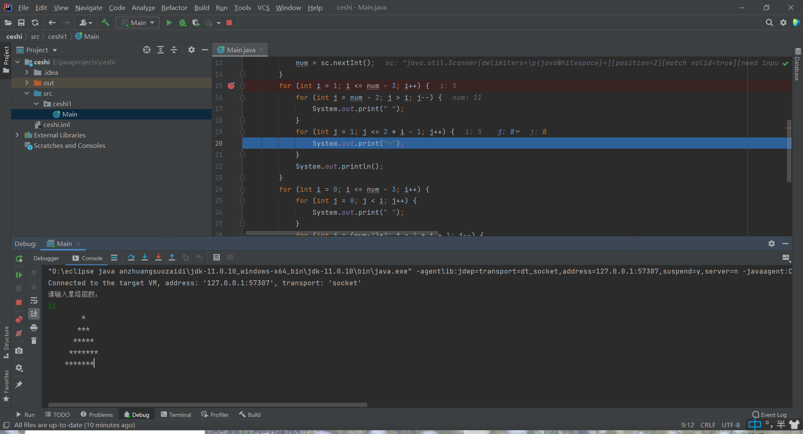
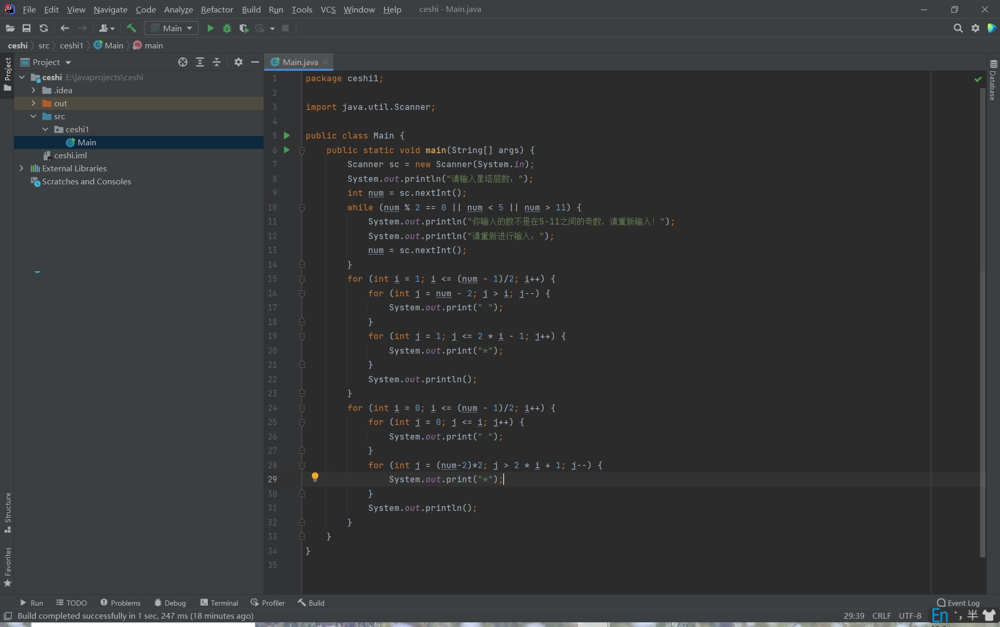

李俊成 20201964

#### 本周工作：

1. 复习到java static final 常量设计 
2. 复习六级 
3. 复习了特征值特征向量和其应用 
4. markdown语法

#### 本周遇到的技术困难及解决方案：
暂无

#### 下周安排：

1. 继续复习java，到java常用类，做课后习题
2. 复习微积分，高代，统计学
3. 复习近代史
4. 准备近代史视频作业

#### 成果展示：

一道个人觉得比较好的题（改了好长时间，网上答案还是错的:( )

